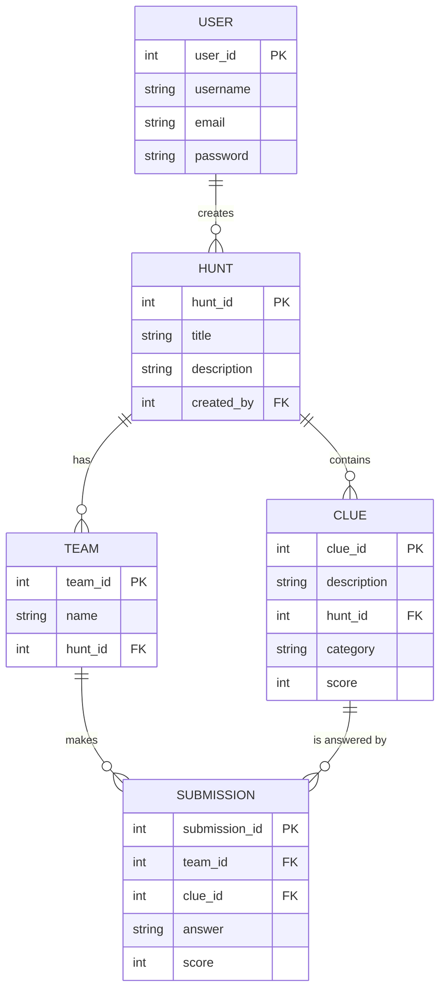

## Data Models

```mermaid
erDiagram
    USER {
        int user_id PK
        string username
        string email
        string password
    }
    
    HUNT {
        int hunt_id PK
        string title
        string description
        int created_by FK
    }
    
    CLUE {
        int clue_id PK
        string description
        int hunt_id FK
        string category
        int score
    }
    
    TEAM {
        int team_id PK
        string name
        int hunt_id FK
    }
    
    SUBMISSION {
        int submission_id PK
        int team_id FK
        int clue_id FK
        string answer
        int score
    }
    
    USER ||--o{ HUNT : "creates"
    HUNT ||--o{ CLUE : "contains"
    HUNT ||--o{ TEAM : "has"
    TEAM ||--o{ SUBMISSION : "makes"
    CLUE ||--o{ SUBMISSION : "is answered by"
```
